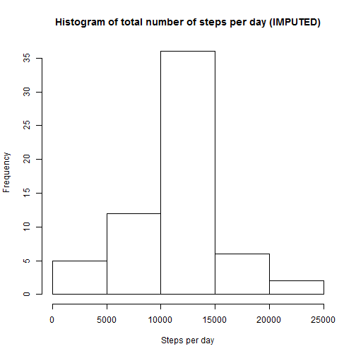

---
title: "Reproducible Research: Peer Assessment 1"
output: 
  html_document:
    keep_md: true

Reproducible Research Project 1
============================================

1 Code for reading in the dataset and/or processing the data


```r
setwd("C:/Users/ladham/Desktop/Projects/R/repdata_2Fdata_2Factivity")
actData =read.csv("activity.csv")
```

2 Histogram of the total number of steps taken each day


```r
new_data <- na.omit(actData)
library(data.table)
dt <- data.table(new_data)
df <- as.data.frame(dt[, list(total = sum(steps)), by = c("date")])
hist(df$total, col=3, main="Histogram of the total number of steps per day", 
     xlab="Total number of steps per day", border = 3)
```


3 Mean and median number of steps taken each day

```r
steps_per_day <- aggregate(steps ~ date, new_data, sum)
round(mean(steps_per_day$steps))
```

```
## [1] 10766
```

```r
median(steps_per_day$steps)
```

```
## [1] 10765
```

4 Time series plot of the average number of steps taken

```r
avg_steps_per_interval <- aggregate(steps ~ interval, new_data, mean)
avg_steps_per_day <- aggregate(steps ~ date, new_data, mean)
plot(avg_steps_per_interval$interval, avg_steps_per_interval$steps, type='l', col=1, main="Average number of steps by Interval", xlab="Time Intervals", ylab="Average number of steps")
```


5 The 5-minute interval that, on average, contains the maximum number of steps

```r
interval_idx <- which.max(avg_steps_per_interval$steps)

print (paste("The interval with the highest avg steps is ", avg_steps_per_interval[interval_idx, ]$interval, " and the no of steps for that interval is ", round(avg_steps_per_interval[interval_idx, ]$steps, digits = 1)))
```

```
## [1] "The interval with the highest avg steps is  835  and the no of steps for that interval is  206.2"
```

6 Code to describe and show a strategy for imputing missing data

```r
# Calculate the number of rows with missing values
missing_value_act <- actData[!complete.cases(actData), ]
nrow(missing_value_act)
```

```
## [1] 2304
```

```r
# Loop through all the rows of activity, find the one with NA for steps.
# For each identify the interval for that row
# Then identify the avg steps for that interval in avg_steps_per_interval
# Substitute the NA value with that value

for (i in 1:nrow(actData)) {
    if(is.na(actData$steps[i])) {
        val <- avg_steps_per_interval$steps[which(avg_steps_per_interval$interval == actData$interval[i])]
        actData$steps[i] <- val 
    }
}

# Aggregate the steps per day with the imputed values
steps_per_day_impute <- aggregate(steps ~ date, actData, sum)
```

7 Histogram of the total number of steps taken each day after missing values are imputed

```r
# Aggregate the steps per day with the imputed values
steps_per_day_impute <- aggregate(steps ~ date, actData, sum)
# Draw a histogram of the value 
hist(steps_per_day_impute$steps, main = "Histogram of total number of steps per day (IMPUTED)", xlab = "Steps per day")
```



```r
# Compute the mean and median of the imputed value
# Calculate the mean and median of the total number of steps taken per day
round(mean(steps_per_day_impute$steps))
```

```
## [1] 10766
```

```r
median(steps_per_day_impute$steps)
```

```
## [1] 10766.19
```

8 Panel plot comparing the average number of steps taken per 5-minute interval across weekdays and weekends

```r
# create function to find weekday
week_day <- function(date_val) {
    wd <- weekdays(as.Date(date_val, '%Y-%m-%d'))
    if  (!(wd == 'Saturday' || wd == 'Sunday')) {
        x <- 'Weekday'
    } else {
        x <- 'Weekend'
    }
    x
}

# Apply the week_day function and add a new column to activity dataset
actData$day_type <- as.factor(sapply(actData$date, week_day))

#load the ggplot library
library(ggplot2)

# Create the aggregated data frame by intervals and day_type
steps_per_day_impute <- aggregate(steps ~ interval+day_type, actData, mean)

# Create the plot
plt <- ggplot(steps_per_day_impute, aes(interval, steps)) +
    geom_line(stat = "identity", aes(colour = day_type)) +
    theme_gray() +
    facet_grid(day_type ~ ., scales="fixed", space="fixed") +
    labs(x="Interval", y=expression("No of Steps")) +
    ggtitle("No of steps Per Interval by day type")
print(plt)
```


